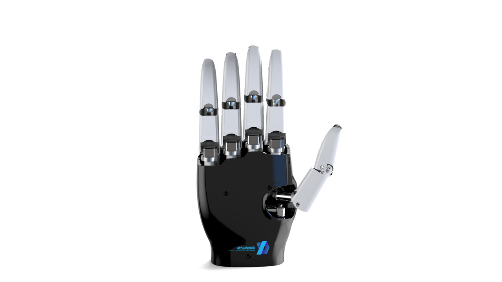

  <h1>灵巧手通用操作指南 Dexterity-Aha-Guide</h1>

>这是一个专为想要快速进入具身智能领域的小伙伴们准备的路线图。本指南重点专注于未来机器人具身智能皇冠上的明珠——通用灵巧手的研究与应用。作为机器人灵巧操作的关键，通用灵巧手不仅涉及到前沿的算法，更需要精妙的机械硬件设计与系统集成。因此，本指南将覆盖从硬件设计、算法开发到应用实践的全链路内容，助你迅速建立对这一领域的全面认知。灵巧手与具身智能操作仍处于充满无限可能的探索阶段，我们欢迎所有对此方向充满好奇和激情的朋友们加入我们，共同探索和攻克具身智能的种种挑战，挖掘蕴藏其中的巨大机遇！🌟

    
与此同时，我们正在积极建设一个更大的开源通用灵巧操作社区平台 **Acosmos**。

**Code to Hand, Zero to Hero** 从代码到实体，从零到超越
    
未来你将能够：
    
🚀 轻松获得低成本的开源灵巧手搭建教程和采购渠道，让每个人都能动手玩转灵巧操作。
    
🎉 参与到围绕灵巧手开展的Workshop和比赛中，发挥创意与实践能力，甚至亲手推动灵巧手技术的进步！
    
如果你也有精彩的想法或希望贡献力量，欢迎联系我们！我们期待与你携手，共同开启通用灵巧手与具身智能的精彩旅程。
喜欢的话，请记得给我们点个Star 🌟，分享给更多志同道合的小伙伴，也欢迎积极提交PR，一起把这个指南做得更棒！

# 精选内容
## 🔥 微型关节模组开源灵巧手 GaiaHand 组装教程

  

> **GaiaHand** 是一款由微型关节模组组装的开源灵巧手，专为机器人爱好者和研究人员设计，提供高自由度和模块化的组装体验。

### 📌 教程亮点：
- **模块化设计**：每个关节独立组装，方便维护与升级。
- **高自由度**：支持多种复杂操作，适配多场景应用。
- **开源资源**：提供完整的设计文件与代码，助力社区创新。

### 📚 资料汇总：
- **[B站组装视频](https://www.bilibili.com/video/BV1Ysjzz4E6D/?buvid=Y34FD53B8124B62B4AC2B0D961F1AF6EBA9B&from_spmid=dt.dt.0.0&is_story_h5=false&mid=WaAUbX%2B2msa3czq%2F2v27EA%3D%3D&plat_id=504&share_from=ugc&share_medium=iphone&share_plat=ios&share_session_id=29CEB906-3D62-46FD-B744-594C40BCE995&share_source=WEIXIN&share_tag=s_i&spmid=dt.dt.0.0&timestamp=1748439056&unique_k=AdGgI1D&up_id=276123533&vd_source=b9a952aeb6ad36adfd92f02ff3b34f58)**：组装过程的详细视频教程。

  

---
> **提示**：如需帮助或有任何疑问，请联系 timmoraty@hotmail.com

# 未来更新计划 Roadmap

我们计划在接下来的时间里，持续更新和完善本指南，以下是我们的一些计划：

- **[开源灵巧手GaiaHand 结构组装教程]**：组装视频已经上传至B站[链接](https://www.bilibili.com/video/BV1Ysjzz4E6D/?buvid=Y34FD53B8124B62B4AC2B0D961F1AF6EBA9B&from_spmid=dt.dt.0.0&is_story_h5=false&mid=WaAUbX%2B2msa3czq%2F2v27EA%3D%3D&plat_id=504&share_from=ugc&share_medium=iphone&share_plat=ios&share_session_id=29CEB906-3D62-46FD-B744-594C40BCE995&share_source=WEIXIN&share_tag=s_i&spmid=dt.dt.0.0&timestamp=1748439056&unique_k=AdGgI1D&up_id=276123533&vd_source=b9a952aeb6ad36adfd92f02ff3b34f58) 开源零件图纸，3D打印说明，物料清单，组装教程 内容正在整理中，预计20250603前发布。
- **[开源灵巧手GaiaHand 代码调试教程]**：预计20250609前 release
- **[灵巧手机械硬件设计]**：规范化、系统性地梳理市面主流灵巧手（含商业与开源），对其结构、参数、适用场景、开源资源与社区活跃度等进行详细对比
- **[English Version]**：待整体内容稳定
- **[Acosmos社区上线]**：积极筹备中

如果您有特别期待的内容，也欢迎通过 [Issues](https://github.com/Wu-Fisher/dexterity-aha-guide/issues) 或邮件告诉我们！

> **提示**： 如需帮助或者有任何疑问或者建议，请联系 wutfisher@outlook.com

# 目录
- [精选内容](#精选内容)
  - [🔥 微型关节模组开源灵巧手 GaiaHand 组装教程](#-微型关节模组开源灵巧手-gaiahand-组装教程)
    - [📌 教程亮点：](#-教程亮点)
    - [📚 资料汇总：](#-资料汇总)
- [未来更新计划 Roadmap](#未来更新计划-roadmap)
- [目录](#目录)
- [1. 如何使用本指南📕](#1-如何使用本指南)
- [2. 灵巧手机械硬件设计⚙️](#2-灵巧手机械硬件设计️)
  - [商业化灵巧手产品一览表](#商业化灵巧手产品一览表)
  - [2.1 绳驱灵巧手](#21-绳驱灵巧手)
  - [2.2 连杆传动灵巧手](#22-连杆传动灵巧手)
  - [2.3 电机直驱灵巧手](#23-电机直驱灵巧手)
  - [2.4 新材料驱动的灵巧手](#24-新材料驱动的灵巧手)
  - [2.5 触觉传感器](#25-触觉传感器)
    - [2.5.1 视触觉传感器](#251-视触觉传感器)
    - [2.5.2 磁场式触觉传感器](#252-磁场式触觉传感器)
    - [2.5.3 压阻式触觉传感器](#253-压阻式触觉传感器)
- [3. 灵巧操作算法🧠](#3-灵巧操作算法)
  - [3.1 强化学习流派](#31-强化学习流派)
    - [3.1.1 参考文献](#311-参考文献)
  - [3.2 模仿学习流派](#32-模仿学习流派)
    - [3.2.1 综述 参考文献](#321-综述-参考文献)
    - [3.2.2 基于仿真生成专家轨迹 参考文献](#322-基于仿真生成专家轨迹-参考文献)
    - [3.2.3 基于video数据的操作 参考文献](#323-基于video数据的操作-参考文献)
    - [3.2.4 基于遥操作数据的操作 参考文献](#324-基于遥操作数据的操作-参考文献)
    - [3.2.5 VLA大模型算法 参考文献](#325-vla大模型算法-参考文献)
    - [3.2.5 Embodied Agent 参考文献](#325-embodied-agent-参考文献)
- [4. 灵巧手操作数据集/Benchmark](#4-灵巧手操作数据集benchmark)
- [5. 灵巧手真实操作数据采集方案](#5-灵巧手真实操作数据采集方案)
  - [5.1 数据采集手套](#51-数据采集手套)
  - [5.2 VR遥操作数据采集系统](#52-vr遥操作数据采集系统)
  - [5.3 外骨骼系统 (带臂外骨骼)](#53-外骨骼系统-带臂外骨骼)
- [6. 灵巧手操作仿真平台](#6-灵巧手操作仿真平台)
  - [6.1仿真模型（urdf，mjcf）推荐：](#61仿真模型urdfmjcf推荐)
  - [6.2仿真物理平台推荐：](#62仿真物理平台推荐)
    - [6.2.1. isaac系：](#621-isaac系)
    - [6.2.2. mujoco系：](#622-mujoco系)
    - [6.2.3 genesis系](#623-genesis系)
- [7. 通识参考（General Reference Guide）](#7-通识参考general-reference-guide)
  - [7.1 人类抓取姿态体系](#71-人类抓取姿态体系)
  - [友链区🔗](#友链区)
- [关于我们/感谢😎](#关于我们感谢)

# 1. 如何使用本指南📕
🌟 本指南旨在帮助你快速了解并深入探索以通用灵巧手为核心的具身智能操作领域，建立完整且系统的知识体系。
🚩 我们强烈建议你先从灵巧手的硬件入手，这是因为本指南的核心理念之一就是：真正实现卓越的灵巧操作具身智能，必须深刻理解硬件与真实物理世界交互的原理与特性，清楚认识硬件本身的优势与不足，才能在此基础上做出真正有效且富有意义的优化与创新！
🤝 此外，指南中也会特别收录一些我们认为极具价值、值得灵巧手操作平台参考的优秀创意与点子，鼓励大家用更加开放的视角，积极探索并实践各种灵巧操作的可能性。

# 2. 灵巧手机械硬件设计⚙️
灵巧手作为机器人末端执行器的重要发展方向，具备高自由度、仿生化设计、高精度感知与控制能力，适合复杂非结构化环境下的精细操作任务。根据驱动方式与传动机制的不同，灵巧手根据驱动类型可划分为绳驱灵巧手、连杆传动灵巧手、电机直驱灵巧手、新材料驱动灵巧手等多种类型。本文在原有分类基础上进一步细化，并结合产业界典型方案与国内企业的布局进行详细介绍。
业界前辈制作的一个总结网站 [[链接](https://mindtrans.narod.ru/hands/hands.htm)]

## 商业化灵巧手产品一览表
| 公司名称       | 灵巧手或零件       | 产品介绍                                                                                   | 应用场景                                                                 |
| -------------- | ------------------ | ------------------------------------------------------------------------------------------ | ------------------------------------------------------------------------ |
| **灵巧智能**   | DexHand021         | 19自由度 (12主动+7被动)，23个传感器，力控精度0.01N，模块化设计，支持量产版、专业版和三指版 | 医疗手术辅助、工业精密装配、物流搬运，脑机接口拓展至渐冻人护理和养老领域 |
| **因时机器人** | RH56系列           | 6自由度、12运动关节，欠驱动设计，重复定位精度±0.2mm，单指抓握力3kg，首创掉电自锁功能       | 工业检测、假肢、教育科研，擅长易碎物品抓取 (如鸡蛋、豆腐)                |
| **强脑科技**   | Revo 2             | 非侵入式脑机接口，0.01N力分辨率，30+材质识别，延时≤10ms，集成TS-F触觉传感器                | 残障辅助、远程精密操作 (如拧开关)、情感交互机器人                        |
| **傲意科技**   | RoHand             | 11自由度 (6主动)，PID控制算法，单指静态负载10kg，整手负载30kg，支持UART/RS485/CAN接口      | 医疗康复 (假肢仿生操作)、人形机器人末端执行器                            |
| **伯牙智能**   | 19自由度假肢灵巧手 | 形状记忆合金 (SMA) 驱动，重量370g，集成科大讯飞语音交互系统                                | 医疗假肢、工业精密装配                                                   |
| **帕西尼感知** | DexH13             | 1956个TPU触觉传感器，7824路信号解析，力控精度0.01N，AI视觉手眼相机                         | 特种环境作业、高端制造、医疗手术，地铁安检已落地                         |
| **灵心巧手**   | Linker Hand系列    | 工业版25-30自由度，科研版42自由度，电子皮肤技术，云端智脑系统，价格仅为Shadow Hand的1/20   | 中医推拿自动化、化妆机器人、精密电子组装                                 |
| **星动纪元**   | 模块化灵巧手       | 12个独立关节模组，指尖力80N，兼容ROS系统，触觉传感器外购帕西尼产品                         | 汽车制造、科研实验，适配特斯拉等头部企业                                 |
| **宇树科技**   | Unitree Dex5       | 20自由度 (16主动+4被动)，94个灵敏触点，首创反向驱动技术，功耗低至10W                       | 物流分拣、娱乐交互，适配人形机器人H1                                     |
| **智元机器人** | SkillHand          | 19自由度 (12主动)，视觉-触觉双模态感知，指尖视觉传感器，自锁阻拉负载30kg                   | 汽车制造、精密工具使用                                                   |
| **优必选**     | Walker S1          | 第三代自研技术，6个阵列式触觉传感器，全栈式操作策略，支持15kg负重行走                      | 工业搬运、服务机器人                                                     |
| **兆威机电**   | 电动直驱仿生灵巧手 | 单指自由度≥3，整手17-20自由度，适配6-24mm空心杯电机                                        | 医疗机器人 (手术辅助)、消费级人形机器人                                  |
| **雷赛智能**   | DH系列             | 11-24自由度，单指负载达40kg，标准化组件降低成本                                            | 工业自动化、协作机器人                                                   |
| **伟创电气**   | 空心杯电机模组     | 8-16mm空心杯电机模组，集成精密减速器，适配欠驱动灵巧手                                     | 人形机器人灵巧手核心部件                                                 |

## 2.1 绳驱灵巧手
绳驱灵巧手是一种通过柔性绳索或线缆传递动力的机械手。它的电机通常安装在手掌或基座位置，通过拉紧或放松连接手指关节的绳索来控制手指的运动（如弯曲或伸展）。这种设计让手指部分更轻巧灵活，适合需要复杂动作的任务（如抓握不规则物体）。但绳索可能存在磨损问题，需要定期维护。

>[!TIP]理解小贴士：想象用线操控木偶，线一拉，木偶就动；线一松，动作还原。

<h3>参考方案</h3>

1. Shadow Hand（英国Shadow Robot公司）：高自由度绳驱灵巧手的先驱，广泛用于科研与工业应用。[[链接](https://www.shadowrobot.com/wp-content/uploads/2024/06/20240610-UPDATED-shadow_dexterous_hand_e_technical_specification.pdf)]
2. 特斯拉Optimus Gen3 灵巧手方案：22个自由度，采用超高分子量聚乙烯纤维（UHMWPE）腱绳+微型丝杠复合传动方案，电机外置于前臂，兼顾轻量化与高精度控制。
3. 韩国做的非常火的仿生绳驱灵巧手 Y. -J. Kim, J. Yoon and Y. -W. Sim, "Fluid Lubricated Dexterous Finger Mechanism for Human-Like Impact Absorbing Capability," in IEEE Robotics and Automation Letters, vol. 4, no. 4, pp. 3971-3978, Oct. 2019, doi: 10.1109/LRA.2019.2929988. 中文详细解读：[[链接](https://zhuanlan.zhihu.com/p/561350692)]
4. Zhe Xu在ICRA上发表的一种仿生肌腱传动的灵巧手。[[知乎解读](https://zhuanlan.zhihu.com/p/561112750)] [[链接](https://ieeexplore.ieee.org/document/7487528)]
5. 对绳索驱动数学建模比较清楚的一款灵巧手 [[链接](https://ieeexplore.ieee.org/abstract/document/9488224)]
6. 油管大神的绳驱开源灵巧手是每一位做灵巧手绕不过去的"高山"。是最火的复刻人数最多的方案：[[链接](https://www.dexhand.org/)] [[链接](https://willcogley.notion.site/Dexhand)]
7. ETH Zurich ORCA Hand：来自ETH软体机器人研究所，马上完全开源的绳驱灵巧手方案，eth软体机器人实验室的开源绳驱灵巧手小臂方案，期待复刻。[[论文](https://arxiv.org/abs/2504.04259)][[项目](https://www.orcahand.com/)]
8. Open Parametric Hand, OPH。来自瑞士洛桑联邦理工学院和英国剑桥大学的研究团队，通过56个可调整参数，可以定制从人手到各种灵长类动物手爪，甚至创造出自然界不存在的手型，如双拇指手。已登上Science Robotics封面。[[论文](https://www.science.org/doi/10.1126/scirobotics.ads6437)][[项目](https://github.com/kg398/100_fingers)]

## 2.2 连杆传动灵巧手
连杆传动灵巧手主要分为串连杆传动和并连杆传动两种。两者的结构布局，力传递路径和控制策略均有所不同。两种方案在国内均有知名的商业化产品。

<h3>参考方案</h3>

1. ILDA并联杆灵巧手：高刚性、高精度，并联杆灵巧手的经典代表，国内灵心巧手、睿研科技等企业均受其启发。参考文献 知乎中文详解：[[知乎链接](https://zhuanlan.zhihu.com/p/563973849)] [[链接](https://www.nature.com/articles/s41467-021-27261-0)]
2. 因时灵巧手（Inspire Robotics）：国内较早实现商业化的串联杆灵巧手，广泛应用于工业自动化。[[链接](https://www.inspire-robots.com/product/frwz/)]
3. 灵心巧手（Linker Hand系列）：国内商业化的连杆与腱绳双结构方案。[[链接](https://www.linkerbot.cn/index)]
4. 宇树科技（Unitree Dex5）：采用反向驱动技术的电机直驱灵巧手，20自由度，适用于物流分拣、娱乐交互场景。
5. 魔法原子（MagicHand S01）：高负载能力，电流与触觉融合控制方案，工业搬运、家庭服务领域应用突出。
## 2.3 电机直驱灵巧手
电机直驱灵巧手是一种直接将微型电机安装在手指关节附近的机械手。每个关节的运动由电机直接驱动，无需通过绳索、齿轮等中间传动部件。这种方式响应速度快、控制精度高，适合需要快速反应的任务（如精细操作）。但手指部分可能因电机重量而略显笨重，结构相对复杂。

>[!TIP]理解小贴士：好比每个关节都绑了一个小马达，马达一转，关节直接跟着动。

<h3>参考方案</h3>

1. LEAP HAND 开源电机直驱灵巧手方案，结构简单，淘宝有售。 [[链接](https://v1.leaphand.com/)]
2. HIT-DLR Hand（哈工大与德国航空航天中心联合开发）：高精度、高自由度电机直驱灵巧手。[[链接](https://www.dlr.de/en/rm/research/robotic-systems/hands/dlr-hit-hand)]
3. 兆威灵巧手：基于自研微型空心杯电机的电动直驱仿生灵巧手，单指自由度≥3，整手17-20自由度，适配医疗机器人、消费级市场。
4. [东林钟声大佬](https://github.com/yunlongdong)做的三指11自由度灵巧手方案，并且还搭配了自制的三指12自由度外骨骼方案。直取灵巧手开源地址：[[链接](https://github.com/Democratizing-Dexterous/DexterousHandGX11)]，外骨骼方案开源地址：[[链接](https://github.com/Democratizing-Dexterous/ExoskeletonGloveEX12)]
## 2.4 新材料驱动的灵巧手
介绍：采用新型材料的特性作为致动器设计出的灵巧手。常见的新材料有形状记忆合金和目前已知功率密度接近人类的LCE液晶聚合物（建议参考清华大学化学系杨忠强老师的文献：J. Ma, Z. Yang*Smart Liquid Crystal Elastomer Fibers.Matter 2025, 8, 101950.2. ）。除此之外，还有一种柔性充气材料，例如气囊，充气后会膨胀缩短，从而作为一种新型致动器。（[[百度百科](https://baike.baidu.com/item/%E5%BD%A2%E7%8A%B6%E8%AE%B0%E5%BF%86%E5%90%88%E9%87%91/4939630)]）

<h3>参考方案</h3>

1. SMA驱动灵巧手：采用形状记忆合金线圈作为驱动器，实现柔性驱动，结构轻巧。[[链接](https://www.mdpi.com/2076-0825/10/1/6)]
2. LCE液晶弹性体驱动软体手指：通过电控液晶弹性体实现多模态柔性驱动，响应快速、仿生度高。[[链接](https://www.researchgate.net/publication/336447702_Electrically_controlled_liquid_crystal_elastomer-based_soft_tubular_actuator_with_multimodal_actuation)]
3. 柔性气囊驱动灵巧手（哈佛大学Robert Wood团队）：3D打印柔性充气结构，实现高仿生度抓取动作。相关工作：
  3D 打印仿生人造肌肉[[链接](https://www.science.org/doi/10.1126/scirobotics.abn4155)],
  随机拓扑抓取[[链接](https://www.pnas.org/doi/10.1073/pnas.2209819119)],
  灵巧柔性机械手[[链接](https://ieeexplore.ieee.org/document/9134855)]
4. 伯牙智能灵巧手：采用SMA驱动的假肢灵巧手，重量仅370g，接近人手重量，集成科大讯飞语音交互系统，适用于医疗假肢市场。

<!-- TODO 链接 -->

## 2.5 触觉传感器

| 传感器类型 | 工作原理                 | 优点                                                               | 缺点                     |
| ---------- | ------------------------ | ------------------------------------------------------------------ | ------------------------ |
| 视触觉     | 通过图像分析接触变形     | 高分辨率、多模态信息 (纹理+力)、不受温度和电磁场等外部环境因素影响 | 计算复杂度高             |
| 压阻式     | 材料受压后电阻变化       | 结构简单、成本低、响应快                                           | 温漂大、非线性、易疲劳   |
| 电容式     | 极板间距变化引起电容变化 | 灵敏度高、动态响应好、低功耗                                       | 易受电磁干扰、需复杂电路 |
| 磁场式     | 磁性材料位移引起磁场变化 | 抗干扰强、耐磨损、动态范围大                                       | 需要磁屏蔽、标定复杂     |
### 2.5.1 视触觉传感器
视触觉传感器是一种融合视觉与触觉感知的智能传感技术，相较于传统压阻式、电容式触觉传感器，其通过高分辨率图像捕捉能够获取更丰富的接触信息。该技术利用弹性接触膜、照明光源和微型成像模块组成的系统，当弹性接触膜与物体接触产生形变时，内置光源从膜层背面均匀照射，微型摄像头实时捕捉形变图像，进而通过图像处理算法解析物体表面纹理、材质特性、受力形变等多维信息，实现对接触物体形状、纹理及三维力场的精确测量。其核心优势在于兼具视觉的空间细节捕捉能力和触觉的压力分布检测功能，典型代表如基于光学原理的GelSight和Insight传感器，通过弹性体变形成像与机器学习算法，可实现亚毫米级的接触力与几何重建精度，目前已广泛应用于机器人灵巧操控、人机安全交互及工业精密检测等领域。

<h3>参考方案</h3>

1. 一种清华的开源9DTact视触觉方案 [[项目](https://linchangyi1.github.io/9DTact/)] [[B站真机制作教程](https://www.bilibili.com/video/BV1nu411w7t4/)]
2. 视触觉的开山之作，Gelsight十五年-简述视触觉传感器发展史:[[知乎链接](https://zhuanlan.zhihu.com/p/691621404)]
3. PP-TAC RSS 2025 首个能抓取不同轻薄纸类的视触觉灵巧手[[论文](https://arxiv.org/pdf/2504.16649)] [[项目](https://peilin-666.github.io/projects/PP-Tac)]   
4. Minsight：具有人类指尖的尺寸与形态，采用机器学习方法以60Hz频率输出三维接触力矢量的高分辨率分布图 , 为经典视触觉传感器,[Insight](https://www.nature.com/articles/s42256-021-00439-3)的小型化版本 [[论文](https://advanced.onlinelibrary.wiley.com/doi/full/10.1002/aisy.202300042)]
### 2.5.2 磁场式触觉传感器
基于磁场的触觉传感器是一种利用磁感应原理实现力觉测量的新型传感技术。其核心部件通常包含磁性材料和磁场传感器阵列，当传感器受到外力作用时，磁性材料的位置或形状发生变化，导致周围磁场分布改变，通过高灵敏度磁传感器（如霍尔元件或磁阻传感器）检测这种磁场变化，即可精确反推出接触力的大小、方向及分布情况。相较于传统触觉传感器，该技术具有抗电磁干扰能力强、测量范围大、耐久性高等优势，尤其适用于强电磁环境下的机器人操作和工业检测应用。典型代表如MagTrix传感器系统，通过三维磁场重构算法可实现毫牛级力测量精度和500Hz以上的动态响应。

<h3>参考方案</h3>

1. 软磁柔性触觉皮肤：[[链接](https://ieeexplore.ieee.org/abstract/document/9050905)]
2. 自解耦三维力触觉传感器：通过优化设计的磁膜结构及其磁场分布，实现了测量区间的近似线性化特性，使传感器具备三维力自解耦测量能力。该设计将系统校准复杂度控制在O(3n)量级，显著降低了传统多轴力传感器标定的复杂性。
  代表性工作：
  (1) 香港科技大学申亚京团队：具备三维力自解耦功能的超分辨率触觉软磁 [[论文](https://www.science.org/doi/abs/10.1126/scirobotics.abc8801)]
  (2) 香港大学Jia Pan团队：一种具有自解耦三轴力感知单元的柔性皮肤 [[论文](https://www.nature.com/articles/s42256-024-00904-9)]
### 2.5.3 压阻式触觉传感器
压阻式传感器是一种基于压阻效应（piezoresistive effect）的力敏传感器，其核心原理是利用敏感材料（如半导体硅、导电弹性体或碳纳米复合材料）在受力时电阻率发生变化的特性来测量压力或形变。当外部力作用于传感器表面时，内部导电网络的微观结构发生改变，导致电阻值产生可测变化，通过惠斯通电桥等电路即可将机械信号转换为电信号输出。这类传感器具有结构简单、响应快、成本低等优势，但其灵敏度易受温度影响，且通常需要复杂的校准补偿。

<h3>参考方案</h3>

1. RP-C7.6-ST薄膜压力传感器
[[链接](https://www.dfrobot.com/product-1841.html)]

# 3. 灵巧操作算法🧠

## 3.1 强化学习流派
强化学习（Reinforcement Learning, RL）在灵巧手控制中被广泛应用于学习复杂、高维的动作策略，尤其适用于传统控制方法难以建模的非线性接触与多指协同操作场景。通过设定奖励函数，RL能够使灵巧手在不断试错中自主探索出优化抓取、旋转、整理等精细操作的策略。相比手工设计控制器或基于轨迹的模仿学习，RL的优势在于其强大的自适应能力——不仅能够适应不同物体形状和材质，还能在存在传感器噪声或动力学不确定性的情况下持续优化表现。未来，强化学习将在灵巧手与通用灵巧操作中仍然会发挥关键的作用，特别是在多模态感知融合、自监督探索和迁移学习方面不断突破，使灵巧系统能够从少量经验中泛化到多样化任务与环境。随着模拟与现实差距的进一步缩小，基于RL的灵巧手控制有望实现更高效的"零样本"迁移与在线适应，为通用具身智能打下坚实基础。

### 3.1.1 参考文献
1. PPO强化学习算法基础：近端策略优化算法 [[论文](https://arxiv.org/abs/1707.06347)]
2. DexPoint 通用点云强化学习实现sim2real灵巧操作 [[论文](https://proceedings.mlr.press/v205/qin23a.html)][[项目](https://yzqin.github.io/dexpoint/)]
3. RoboPianist 机器钢琴师：强化学习实现灵巧钢琴演奏 [[论文](https://openreview.net/forum?id=HDYMjiukjn)][[项目](https://kzakka.com/robopianist/)]
4. TOPDM 通过轨迹优化和强化学习来解决具有挑战性的灵巧操纵任务 [[论文](https://arxiv.org/abs/2009.05104)][[项目](https://dexterous-manipulation.github.io/.)]
5. Getting the Ball Rolling 学习具有滚动接触关节的仿生肌腱驱动手的灵巧策略 [[论文](https://arxiv.org/abs/2308.02453)][[项目](https://srl-ethz.github.io/get-ball-rolling/)]
6. ArrayBot Arraybot：通过触摸进行泛化的分布式操作的强化学习 [[论文](https://arxiv.org/abs/2306.16857)][[项目](https://steven-xzr.github.io/ArrayBot/)]
7. HuDOR 通过灵巧手与物体轨迹差异生成奖励，指导灵巧手做Online RL学习残差策略 [[论文](https://arxiv.org/abs/2410.23289)][[项目](https://object-rewards.github.io/)]
8. safe-hand-manipulation 灵巧操作的限制强化学习 [[论文](https://arxiv.org/abs/2301.09766)][[项目](https://github.com/GT-STAR-Lab/constrained-rl-dexterous-manipulation)]
9. In-hand Object Reorientation 强化学习训练灵巧手做物体的重新定位 [[论文](https://arxiv.org/abs/2111.03043)][[项目](https://taochenshh.github.io/projects/in-hand-reorientation)]
10. DexSinGrasp 基于强化学习实现物体分离与抓取统一策略 [[论文](https://arxiv.org/abs/2504.04516)][[项目](https://arxiv.org/abs/2504.04516)]
11. RobustDexGrasp 一种基于单视图输入的零样本动态灵巧抓取框架，使用手部中心的动态距离向量表示局部接触形状，有效提升了对形状变化和扰动的泛化能力。通过特权教师策略和混合课程学习，学生策略在模拟训练后可稳健应对多种扰动。[[论文](https://arxiv.org/pdf/2504.05287)]
12. 

## 3.2 模仿学习流派
模仿学习（Imitation Learning）在灵巧手控制中之所以日益流行，是因为它能够绕过强化学习中代价高昂的探索过程，直接从人类或专家示范中学习高质量策略，特别适合处理高维、接触复杂且奖励稀疏的任务场景。相比强化学习，模仿学习可以更快收敛于合理策略，减少训练时间与硬件磨损，并能通过离线数据构建初始策略，有效提升真实部署的可行性。然而，它也存在明显的局限，例如对训练数据分布的高度依赖，泛化能力相对较弱，难以应对未见过的物体或变化环境。随着大规模示范数据、视频模仿和跨模态表示学习的发展，模仿学习正朝向更强的泛化能力和更少监督的端到端操控迈进。未来，它将与强化学习和自监督技术深度融合，推动灵巧操作系统向更自然、高效的学习机制演化。

### 3.2.1 综述 参考文献
基于模仿学习的灵巧操作方法综述, [[论文](https://arxiv.org/pdf/2504.03515)]

### 3.2.2 基于仿真生成专家轨迹 参考文献

通过仿真环境生成专家轨迹，模型可以在没有真实数据的情况下进行训练。这种方法具有高效、可控的优点，但可能面临仿真与现实之间的差距问题。

1.$\mathcal{D(R,O)}$ Grasp 通过专家抓取数据训练一个统一表示的模型，实现跨不同机械手和物体的灵巧抓取。文章核心在于建立了学习手-物交互的表征$\mathcal{D(R,O)}$框架，支持高效泛化到新手型与新物体。[[论文](https://nus-lins-lab.github.io/drograspweb/static/data/D(R,O)Grasp.pdf)][[项目](https://nus-lins-lab.github.io/drograspweb/)]

### 3.2.3 基于video数据的操作 参考文献
通过学习人类操作的视频演示，模型可以从视觉上理解任务意图和物体交互模式，进而生成相应的动作策略。这种方式具有低成本、易获取的优势，但面临感知-动作对齐困难、三维理解不准确等挑战，通常需要配合语言引导或先验知识提升学习效果。
1. Robotic Telekinesi：基于网上的video数据进行机械手操作的学习。[[论文](https://arxiv.org/abs/2202.10448)][[项目](https://robotic-telekinesis.github.io/)]
2. DexVIP：利用人类手部姿态先验知识从视频中学习灵巧抓取。[[论文](https://arxiv.org/abs/2202.00164)][[项目](https://vision.cs.utexas.edu/projects/dexvip-dexterous-grasp-pose-prior)]

### 3.2.4 基于遥操作数据的操作 参考文献
遥操作数据来自于人类通过VR、手套、跟踪器等设备对机器人进行控制，能直接提供高质量的动作轨迹和多模态传感信息。这种方式适合高精度任务学习，策略稳定性强，但采集成本较高，且对设备精度与操作熟练度有一定依赖。
1. DIME：单个RGB摄像头观察人类操作员并遥操作机器人手的灵巧模仿学习。[[论文](https://arxiv.org/abs/2203.13251)][[项目](https://nyu-robot-learning.github.io/dime/)]
2. Tilde：一个高效高质量的演示数据收集，并通过Diffusion Policy实现自主操作。[[论文](https://arxiv.org/pdf/2405.18804)][[项目](https://sites.google.com/view/tilde-)]
3. GLOSH：使用视觉运动扩散策略学习多指手灵巧手内操作的框架，通过快速响应的Allegro Hand遥操作系统收集高质量的专家演示，实现了复杂的瓶盖拧开等任务。[[论文](https://arxiv.org/pdf/2503.02587)][[项目](https://dex-manip.github.io/)]
4. CordViP 一种基于物体的鲁棒6D位姿估计和机器人本体感知的pipeline。该pipeline能够在真实世界环境中实时获取完整的3D表示和语义流。该方法构建手-物体之间的交互感知点云，利用接触图和手臂协调信息来促进对空间和时间一致性的理解，解决单视角点云质量差与缺乏接触信息的问题。[[论文](https://www.arxiv.org/abs/2502.08449)][[项目](https://aureleopku.github.io/CordViP/)]

### 3.2.5 VLA大模型算法 参考文献 
借助如VLA（Vision-Language-Action）等多模态大模型，机器人可以从大规模网络数据中提取通用感知与任务理解能力，再通过少量实例快速适配新任务。这类方法展现出优越的泛化能力和上下文理解能力，是构建通用灵巧操作智能的重要方向之一。
1. 英伟达GR00T N1：一种开放基座模型，融合快慢模型的系统。[[论文](https://arxiv.org/abs/2503.14734)][[知乎详解](https://zhuanlan.zhihu.com/p/32622954748)]
2. DexGraspVLA：灵初智能最新的灵巧手VLA大模型，将多样化的语言和视觉输入迭代地转换为领域不变的表示，缓解了domain-invariant，提高了模仿学习的鲁棒性。[[论文](https://arxiv.org/abs/2502.20900)][[项目](https://dexgraspvla.github.io/.)]
3. 星动纪元开源VLA Video Prediction Policy：一种通用机器人策略，具有预测性视觉表示。[[论文](https://arxiv.org/pdf/2412.14803)][[项目](https://video-prediction-policy.github.io)]
4. 具身思维链推理：使机器人能够以文本方式推理其任务、观察和行动。[[论文](https://arxiv.org/pdf/2407.08693)][[项目](https://embodied-cot.github.io./)]
5. pi0.5：设计了双阶段推理——根据高级指令生成底层指令，以增加泛化性。[[论文](https://www.physicalintelligence.company/download/pi05.pdf)][[项目](https://www.physicalintelligence.company/blog/pi05)]

### 3.2.5 Embodied Agent 参考文献
借助语言或多模态大模型搭建Agent，通过语言和图像输入进行机器人决策。
1. Code as Policie：LLM根据指令编写代码控制机器人。[[论文](https://arxiv.org/pdf/2209.07753) ][[项目](https://code-as-policies.github.io/)]
2. PaLM-E：一个大型多模态模型，可以在多个模态上通过多种观察模式处理各种模态推理任务。[[论文](https://arxiv.org/pdf/2303.03378)] [[项目](https://palm-e.github.io/)] 
3. ChatGPT for Robotics：将ChatGPT的功能扩展到机器人领域，用语言直观地控制多个平台，如机械臂、无人机和家庭助理机器人。[[论文](https://www.microsoft.com/en-us/research/wp-content/uploads/2023/02/ChatGPT___Robotics.pdf)][[项目](https://www.microsoft.com/en-us/research/articles/chatgpt-for-robotics/)]

# 4. 灵巧手操作数据集/Benchmark
相比传统两指或刚性夹爪的操作任务，灵巧手控制涉及更高维度的关节动作、更复杂的多指协调与更细粒度的接触建模，因此在数据采集、标注与标准化评测方面门槛更高。夹爪任务中常见的抓取数据集往往只需记录二分类的"成功/失败"标签即可构建数百万规模的离线样本（如MultiGrasp、DexNet等）；而灵巧手操作则需要完整记录多自由度的时序动作、力接触分布甚至环境变化，造成采集系统昂贵、遮挡难以消除，数据也难以标准化复用。此外，由于灵巧操作目标多样（如旋转、捏取、递物、整理等），数据泛化能力与硬件无关性也成为核心挑战。数据集往往还分为两类：一类是基于仿真生成的合成数据集，另一类是基于真实操作采集的真实数据集。前者通常具有更高的可控性和多样性，但可能面临仿真与现实之间的差距问题；后者则能提供更真实的操作数据，但采集成本较高，且对设备精度与操作熟练度有一定依赖。

1. Dexmimicgen 通过60条少量遥操作真实操作数据，利用仿真引擎生成20k+条灵巧操作数据 [[链接](https://dexmimicgen.github.io/)]
2. DexManipNet 来自工作 ManipTrans，将多种Human-Object的交互数据迁移到了各种灵巧手上 [[链接](https://maniptrans.github.io/)]
3. DexCap 设计出了一套便携式的装置，采集人类手操作的动捕数据 [[链接](https://dex-cap.github.io/)]
4. ARCTIC 数据集包含210万帧视频，记录了双手操作铰接物体的过程，提供精确的3D手部和物体网格，以及详细的动态接触信息。 [[链接](https://arctic.is.tue.mpg.de/)]
5. DexArt 是一个基准测试平台，专注于灵巧手对铰接物体的操作，支持多任务学习和点云感知，提升策略的泛化能力。 [[链接](https://www.chenbao.tech/dexart/)]
6. RealDex 是一个多模态数据集，通过遥操作系统同步人类和机器人手部姿态，捕捉真实的灵巧手抓取动作，促进人类般操作策略的学习。[[链接](https://4dvlab.github.io/RealDex_page/)]
7. GraspM3 基于isaacgym生成的shadow hand 和 mano hand的抓取数据集，通过LLM进行后续语义标注 [[链接](https://github.com/lihaoming45/GraspM3)]
8. EgoDex 使用Apple Vision Pro VR 系统采集的大量自我中心的灵巧人类操作数据集 [[论文](https://arxiv.org/abs/2505.11709)]
9. DexGarmentLab 一个专为灵巧（尤其是双手）衣物操作设计的仿真环境，包含15种任务场景和高质量3D衣物模型，显著缩小仿真与现实的差距。[[链接](https://wayrise.github.io/DexGarmentLab/)]
10. OphNet-3D 首个大规模医学领域中眼科手术的 RGB-D 三维重建数据集，提供细粒度手术阶段标注、双手MANO网格、工具6DoF姿态等丰富标签。基于该数据集，作者提出双手姿态估计与手-工具交互重建两个benchmark，[[论文](https://www.arxiv.org/abs/2505.17677)]
11. Dexonomy 一种通用的灵巧抓取合成方法，仅需每种抓取类型一个人工模板，即可生成接触丰富、无穿透、物理可行的抓取姿态。通过两阶段优化（先配准物体再微调手部），并引入基于接触感知的控制策略，构建了包含31类抓取类型、9.5M条数据的大规模数据集。[[链接](https://pku-epic.github.io/Dexonomy/)]

# 5. 灵巧手真实操作数据采集方案
通用灵巧操作的发展离不开高质量的真实示范数据，而灵巧手控制所需的数据采集系统也逐渐趋于多样化。目前主流的采集方式主要包括三类：基于遥操作系统的数据采集、基于数据手套的直接采集，以及基于外部感知设备间接重建的采集方法。这些方式各有优劣，常常根据任务需求、设备预算和精度要求进行选择组合。详见具身智能数据采集系统详细分类：[[链接](https://zhuanlan.zhihu.com/p/5777752031)]

## 5.1 数据采集手套
数据手套一般通过可穿戴设备精确记录每根手指的角度或者末端位姿、速度等信息，是获取真实操作轨迹最直接的方式。其优点是精度高、结构直观，适合构建标注清晰、连续性强的数据集。
1. 斯坦福博士张寒的外骨骼数据手套: [[链接](https://do-glove.github.io/)]
2. Manus Metagloves Pro: 提供高保真度的指尖追踪。尽管数据质量高，但这类设备通常成本较高，对硬件环境有一定依赖。各家设备适配不同的灵巧手情况不一，实际映射效果需要不同程度的调整。[[链接](https://www.manus-meta.com/products/metagloves-pro)]
3. DexWild: 提出了一种结合人类和机器人演示进行联合训练的方法 DexWild，通过一个低成本、便携式的DexWild-System系统大规模采集人类灵巧操作数据，在极少机器人数据下训练出可泛化到不同任务、场景和机器人平台的操控策略。[[链接](https://dexwild.github.io/)]

## 5.2 VR遥操作数据采集系统
这类方法通过VR设备（如VisionPro、HTC等）结合虚拟场景或真实遥控任务，由人类操作者远程控制灵巧手采集操作数据。它采集成本相对较低。是目前广泛用于构建"从人到机"映射策略的重要手段。

1. Bunny-VisionPro：使用VR进行数据采集，使用触觉传感器进行反馈增强操作者对物体的感知。[[论文](https://arxiv.org/abs/2407.03162)][[项目](https://dingry.github.io/projects/bunny_visionpro)]

2. DEXCAP：基于SLAM和电磁场完成对手指和手腕的精确追踪。[[论文](https://arxiv.org/abs/2403.07788)][[项目](https://dex-cap.github.io/)]

3. OPEN TEACH：基于价格实惠的Meta Quest 3构建，可通过易于使用的应用程序实时控制各种机器人，包括多指手、双手手臂和移动机械手。[[论文](https://arxiv.org/abs/2403.07870)][[项目](https://open-teach.github.io/)]
4. OpenVR：使用Oculus VR耳机遥控Franka Emika Panda机器人。[[论文](https://arxiv.org/pdf/2305.09765)][[项目](https://github.com/Abraham190137/TeleoperationUnity)]
5. Holo-Dex：是一个灵巧操作框架，通过商用VR头戴设备将教师置于沉浸式混合现实中。头戴设备内置的高保真手势估计器用于远程操作机器人，并收集各种通用灵巧任务的演示。[[论文](https://arxiv.org/pdf/2210.06463)][[项目](https://holo-dex.github.io/)]

## 5.3 外骨骼系统 (带臂外骨骼)

1. ACE：跨平台的视觉外骨骼系统，利用面向手部的摄像头捕捉3D手部姿势，并利用安装在便携式底座上的外骨骼，能够精确地实时捕捉手指和手腕的姿势。[[论文](https://arxiv.org/pdf/2408.11805)][[项目](https://ace-teleop.github.io/)]
2. AirExo：一款低成本、适应性强且便携的双臂外骨骼，用于远程操作和演示收集，尤其是大规模收集低成本的野外演示数据。[[论文](https://arxiv.org/abs/2309.14975)][[项目](https://airexo.github.io/)]
3. 因时机器人外骨骼力控手套：集成了5个直线伺服驱动器，用户接口采用蓝牙4.0和RS232方式，内置灵敏的压力传感器，每根手指可提供3N的主动力和5N被动力，可用于康复外骨骼应用、带力反馈遥操作等应用场景。[[链接](https://www.inspire-robots.com/tuijian/lqspeijian/2025-04-17/253.html)]
4. 戴蒙穿戴式遥操作系统：[[链接](https://www.dmrobot.com/products/p3/dm-exton.html)]

# 6. 灵巧手操作仿真平台
灵巧手（Dexterous Hand）操作仿真平台在机器人研究和应用中扮演着重要角色，尤其在强化学习、模仿学习、抓取与操控策略开发等领域。以下是一些值得推荐的仿真平台和资源：

❤️ 推荐一个专注于机器人物理仿真平台的社区 Simulately [[Wiki链接](https://simulately.wiki/)]

## 6.1仿真模型（urdf，mjcf）推荐：
1. 由 Google DeepMind 提供的高质量 MJCF 格式机器人模型集合，涵盖多种机器人系统，包括灵巧手模型。 [[链接](https://github.com/google-deepmind/mujoco_menagerie)]
2. 由 DexSuite 提供的 URDF 格式灵巧手和对象模型集合 [[链接](https://github.com/dexsuite/dex-urdf)]

## 6.2仿真物理平台推荐：

### 6.2.1. isaac系：

1. Isaacsim：基于omniverse构建，拥有大量仿真资产，支持真实物理模拟、合成数据模拟、高质量渲染。[[链接](https://developer.nvidia.com/isaac/sim)] 

2. Isaaclab：基于Isaacsim开发，提供高保真物理模拟。弥合了高保真模拟和基于感知的机器人训练之间的差距。[[链接](https://developer.nvidia.com/isaac/lab)] 

3. Nvidia-warp：用于编写高性能模拟和图形代码的 Python 框架，可微分，支持PyTorch、JAX 和 Paddle 等框架。[[链接](https://nvidia.github.io/warp/index.html)] 

### 6.2.2. mujoco系：

1. Robosuite：基于 MuJoCo 的模块化仿真框架，提供多种机器人任务和基准环境，适用于机器人学习研究，目前已经更新到5.0版本。 [[链接](https://github.com/ARISE-Initiative/robosuite)]

2. Mujoco-playground：基于 MJX 构建，支持多种机器人平台，旨在简化仿真、训练和 sim-to-real 转移过程。 [[链接](https://playground.mujoco.org/)]

3. Mujoco-warp：结合 MuJoCo 和 NVIDIA Warp 的优势，提供高性能的可微分仿真环境，适用于需要梯度信息的优化任务。 [[链接](https://github.com/google-deepmind/mujoco_warp)]

### 6.2.3 genesis系

1. Genesis：专为通用机器人/具身智能/物理 AI打造的高性能仿真平台。轻量化的同时提供高保真的物理引擎（在柔性物体和触觉上具备优势）。支持人造通用数据生成。 [[链接](https://github.com/Genesis-Embodied-AI/Genesis)]

# 7. 通识参考（General Reference Guide）
## 7.1 人类抓取姿态体系 
为什么要学习人类通识知识？人类抓取姿态蕴含了稳定性、灵活性与触觉反馈等自然启发，可为灵巧手提供"先天合理"的结构—策略匹配思路。[[链接](https://www.science.org)]

**典型抓取分类体系速查表**
| 分类体系                   | 主要特点                                                      | 适用场景                             | 代表引用                                                        |
| -------------------------- | ------------------------------------------------------------- | ------------------------------------ | --------------------------------------------------------------- |
| **Napier 双分法**          | 最早提出“力量 vs. 精细”功能视角，奠定后续研究框架             | 快速判别任务对握持稳定性或灵巧性偏重 | [链接](https://scispace.com/pdf/the-prehensile-movements-of-the-human-hand-3cwm2534xp.pdf?utm_source=chatgpt.com)                                                      |
| **Cutkosky 16 类**         | 结合制造场景，总结16种工件抓取；树状层级体现抓取—对象尺寸关系 | 工业装配、夹具设计                   | [链接](https://www.researchgate.net/publication/3298011_On_grasp_choice_grasp_models_and_the_design_of_hands_for_manufacturing_tasks?utm_source=chatgpt.com)                                                  |
| **Science Robotics 28 类** | 基于日常交互语境，扩展到28种常用抓取；覆盖社交递物等情境      | 服务机器人、人机协作                 | [链接](https://www.science.org/doi/10.1126/scirobotics.aau9757) |
| **GRASP 33 类**            | 综述并统一多家分类标准，引入“对抗方式+虚拟手指”四维编码       | 学术研究、通用算法对齐               | [链接](https://www.eng.yale.edu/grablab/pubs/Feix_THMS2016.pdf) |
| **定量综合分类**           | 利用统计学与力学指标，将现有分类映射到可量化特征空间          | 数据驱动抓取评估                     | [链接](https://pmc.ncbi.nlm.nih.gov/articles/PMC6377750/?utm_source=chatgpt.com)                                                           |

**使用建议**
1. 场景选择：在工业抓取基准测试中，Cutkosky 体系足够；在日常操作研究中，优先采用 Science Robotics 或 GRASP 体系。
2. 标签映射：若数据集中已有自定义标签，可建立到 GRASP 33 的映射表，方便与社区结果对比。
3. 多层级评估：粗层级先区分 Power / Precision，细层级再落到 28/33 类，可降低标注难度。

## 友链区🔗

Lumina具身智能社区+具身智能指南: [链接](https://github.com/TianxingChen/Embodied-AI-Guide/tree/main)

# 关于我们/感谢😎
<b>🦉Contributors</b>: <a href="https://scholar.google.com/citations?user=ZT8JOZEAAAAJ&hl=en">位德浩</a>，吴桐</a>，<a href="https://github.com/sen-code-lost">郭川俊</a>，<a href="https://github.com/woltium">王文晟</a>，林清泉</a>

欢迎推广，贡献，交流，合作 联系方式： wutfisher@outlook.com
